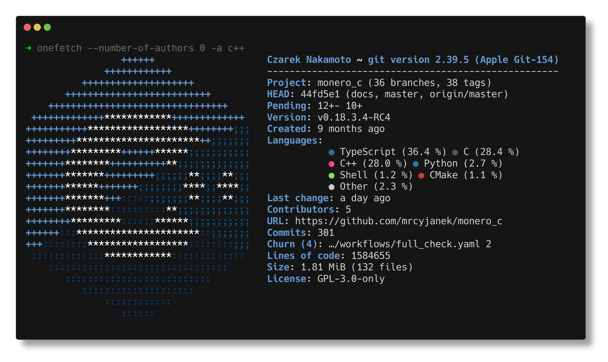

# About

## Goal

The goal of monero_c is simple, at least on the surface
- Build monero for all platforms
- Access monero functions from all languages
- Bring in new features used by wallets but still not merged upstream

To achieve these tasks some major changes had to happen to monero.

## Building

For the most part `contrib/depends` directory of `monero` was used, as it is in perfect shape (that being said it's
terrible to debug when something goes wrong). But it doesn't work with iOS, and it doesn't work on macOS, so some
dependencies had to be pulled as a submodules. But that being said, linux can be used to build for all platforms (except
for iOS - you need macOS for that, and you also need that 100EUR/year license to actually be able to do something with
said library).

This is especially good because any device can run linux, on WSL2 or under docker.

## Accessing monero functions

Though just building the library is not enough, if you just `make wallet_api` in the upstream code you end up in a
place where you technically have the functions in a dynamic library, but you can only use C++ ABI to interact with it.
Which is not ideal. Of course, it is doable, if you want to deal with `__ZNK6Monero10WalletImpl7addressEjj` instead of
`MONERO_Wallet_address`, and make sure that the way you pass in variables is what C++ expects.
I went with the simplest and most standard way of doing that - C ABI (which is what monero should offer in the first
place). Now with any language that supports C interop you can just go ahead and use monero wallet.

All functionality is simplified to use only the following types:

- bool
- int
- uint64_t
- void*
- const char*
- void

## Bring in new features

There are some extra features inside of the code like
- Polyseed support
- Background sync
- Airgap functions
- Coin control
- UR support
- Ledger support (on android and iSO)
- many fixes

These features land in the `patches` directory, and are applied to the upstream monero code.

## Summary

monero_c extends monero functionality and also simplifies it by a huge extent, if you want to use monero - monero_c is
probably the way to go.
Are you ready to start? Let's see how to build the binary.